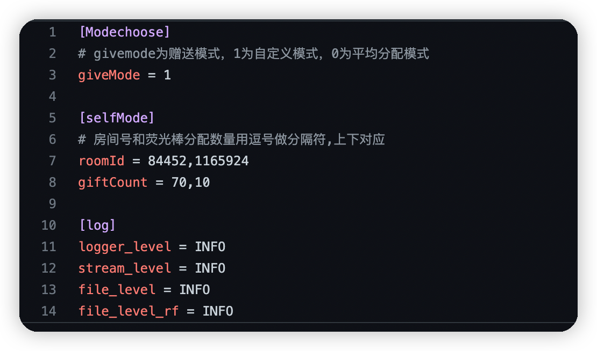
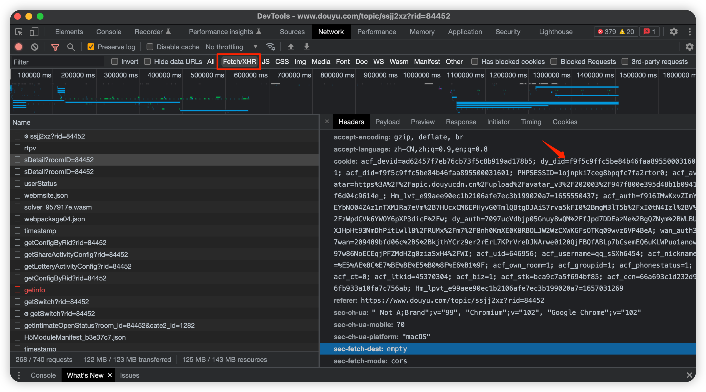
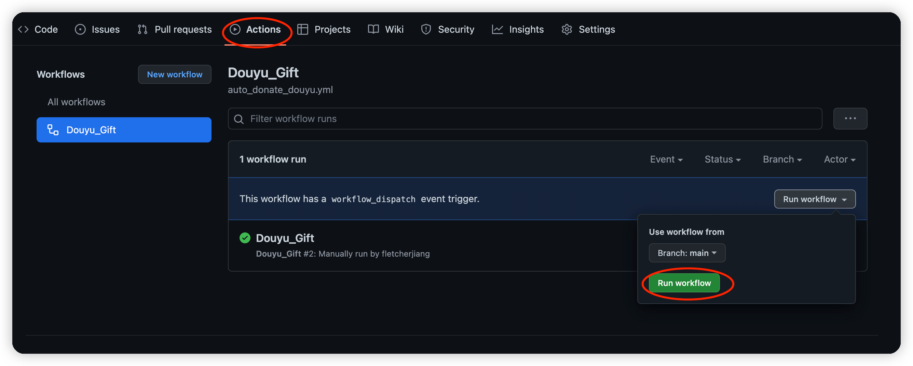
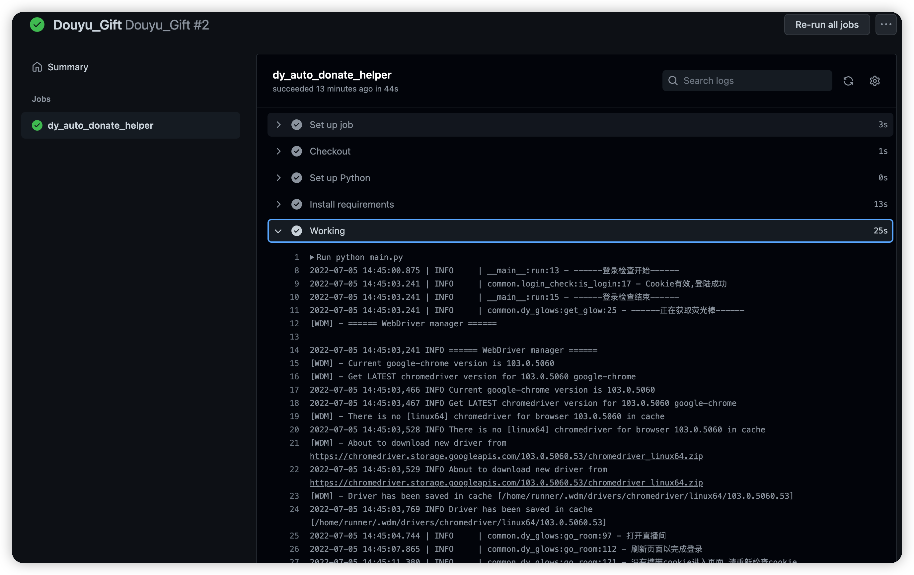

<div align="center">
<h1 align="center">
DouYuGift 斗鱼荧光棒自动赠送
</h1>

</div>

## News
* 2023年2月更新！！！：修复BUG
**UnicodeEncodeError: 'latin-1' codec can't encode characters in position xx-xx: ordinal not in range(256)


## 简介
斗鱼自动获取粉丝荧光棒并且赠送，支持不同直播间


## 功能列表
* [x] 每天凌晨0点启动
* [x] 自动获取荧光棒
* [x] 自定义赠送的房间
* [x] 平均分配荧光棒至拥有粉丝牌的房间
* [x] 推送日志

<!-- 
# 目录
- [目录](#目录)
    - [使用说明](#使用说明)
      - [一、Actions方式](#一、Actions方式(推荐))
      - [二、本地执行](#二、本地执行(不推荐)) -->

## 使用说明

### 一、Actions
1. **首先Fork本项目**
2. 修改config.ini配置文件（config/config.ini）
3. **获取自己斗鱼账号的COOKIE**(注意：斗鱼的Token大概一周会失效，因此需要每周更新一次)
4.  使用浏览器登录斗鱼
5.   按下F12打开[开发者工具]，在[网络/network]中打开筛选，选择XHR
6.   随意点击一个请求,将请求头中的cookie复制出来

   
7. 在项目内点击Setting -> Secrets -> New Secrets,并添加获取到的COOKIES

| Name        | Value                    |
|-------------|--------------------------|
|COOKIES      |按步骤5获取                 |
|SERVERPUSHKEY|server酱(Turbo版)的推送sckey|

8. **开启Actions 并触发每日自动执行**
   **Fork仓库之后，GitHub默认不自动执行Actions任务,请手动执行一次以检查工作流**
   
   
9. 如果需要修改每日执行任务的时间,请修改`.github/auto_donate_douyu.yaml`下的`schedule`
```yml
  schedule:
    - cron: '00 1 * * *'
    # cron表达式，Actions时区是国际时间，国际时间1点的时候，国内时间是早上9点。
    # 示例： 每天晚上22点30执行 '30 14 * * *'
-   # 部分直播间会在周末开启双倍亲密度，可以修改时间表，实现每周末赠送
    # 示例： 每周天凌晨12点30分执行 '0 30 16 ? * 7 '
```
如果收到了 GitHub Action 的错误邮件，请检查 Cookies 是不是失效了，用户修改密码、踢除设备下线，会导致 COOKIES 失效

请各位使用 Actions 时务必遵守Github条款。不要滥用Actions服务。

Please be sure to abide by the Github terms when using Actions. Do not abuse the Actions service.

**查看Actions运行日志**
1. 进入Actions查看日志
    

  
